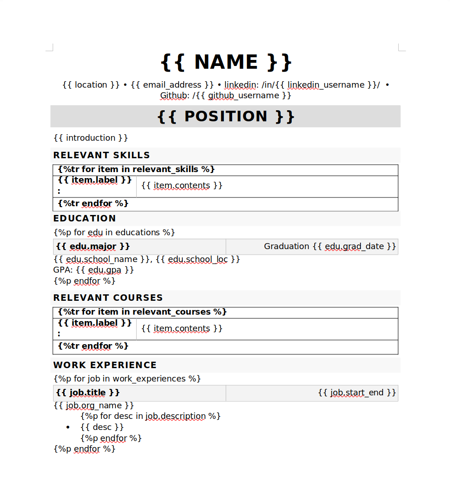
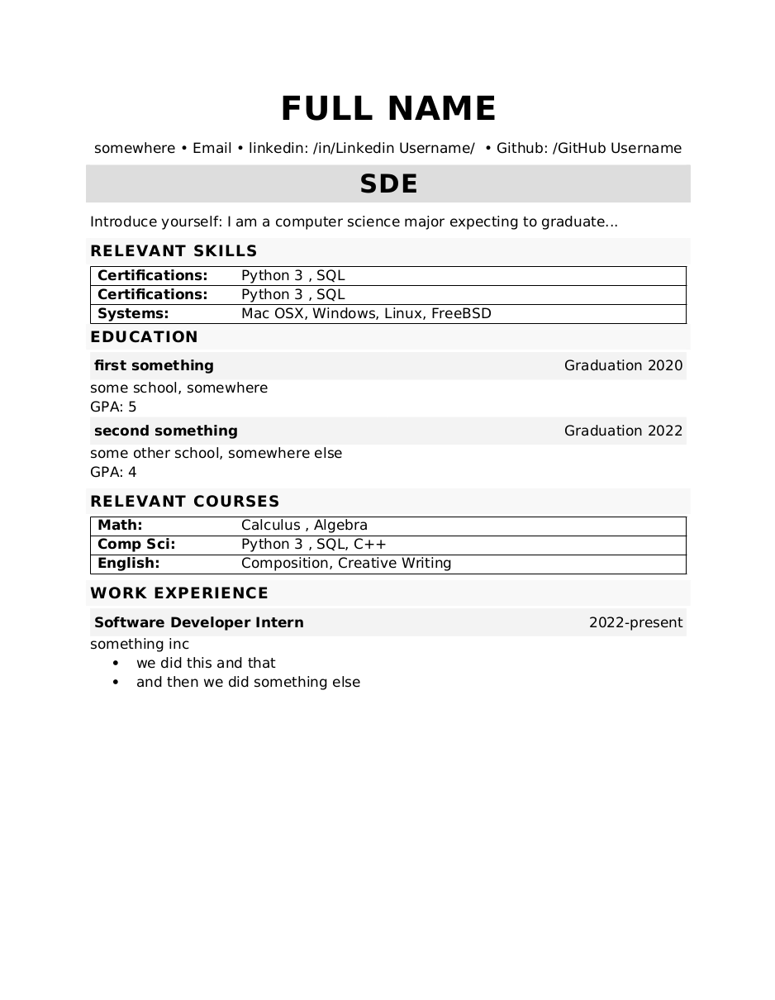
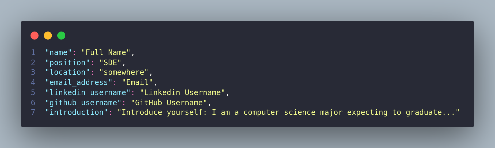

# CV Gen

Updating your Résumé should be easy. In this current climate where we are learning new stuff everyday,
adding your newly learned skills to your CV can get tedious. So I did what every Python developer does, **Spend hours trying to automate the easiest tasks**.

CV Gen is a Python program that generates a Résumé based on the Information you provide.

## Table of Contents

-   [Features](#Features)
-   [Installation](#Installation)
-   [Dependencies](#Dependencies)
-   [Data & Privacy](#data--privacy)

## Features

-   [x] Uses a template to output all the provided information.
-   [x] Updating is very easy.
-   [ ] GUI to add and remove data with ease
-   [x] Key/Value stored in a seperate file giving you macro control over the information you provide.

### Snippets

The program uses a Template and populates it Dynamically.

        

            
Before

            
        

        

            
After

            
        

Uses JSON as a database

    

        
    

## Installation

> Installation isn't tested for cross platform yet

## Dependencies

#### Global

-   Python 3.8 +
-   Latest pip
-   [pipenv](https://github.com/rp-bot/django_checklist#pipenv-installation) - _(link leads to pipenv installation steps)_

#### GUI

-   QT designer

#### Other

-   /templates/\*.docx/

## Data & Privacy
